# Simple Docker

Введение в докер. Разработка простого докер-образа для собственного сервера.

## Содержание

[Part 1. Готовый докер](#part-1-готовый-докер) \
[Part 2. Операции с контейнером](#part-2-операции-с-контейнером) \
[Part 3. Мини веб-сервер](#part-3-мини-веб-сервер) \
[Part 4. Свой докер](#part-4-свой-докер) \
[Part 5. Dockle](#part-5-dockle) \
[Part 6. Базовый Docker Compose](#part-6-базовый-docker-compose)

## Part 1. Готовый докер

- Возьми официальный докер-образ с nginx и выкачай его при помощи docker pull.

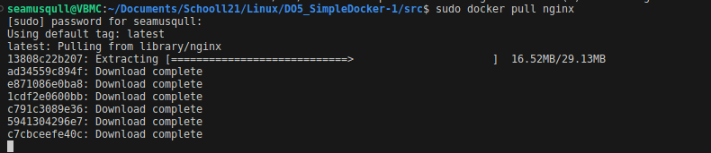 *Получаем образ* 

- Проверь наличие докер-образа через docker images.

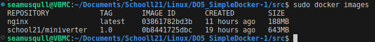 *обзар скачался, через команду видим результат* 

- Запусти докер-образ через `docker run -d [image_id|repository]`.

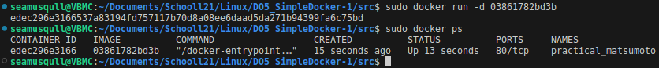 *Запускаем контейнер* 

- Проверь, что образ запустился через docker ps.

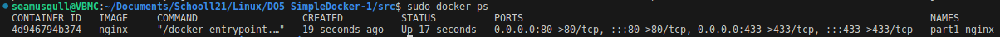 *Посмотрим список всех запущенных контейнеров* 

- Посмотри информацию о контейнере через `docker inspect [container_id|container_name]`.

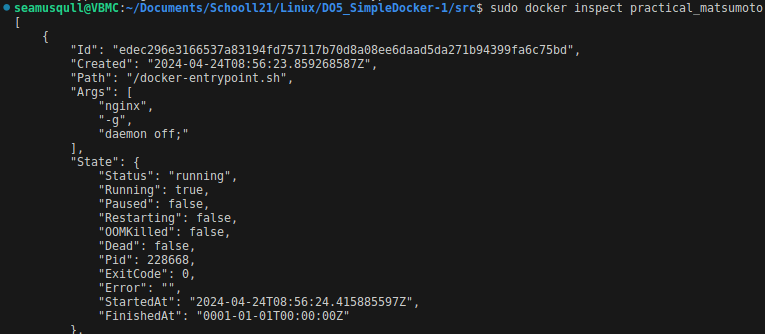 *Этой командой смотрим все доступные данные по контейнеру* 

- По выводу команды определи и помести в отчёт размер контейнера, список замапленных портов и ip контейнера.

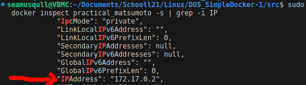 *Айпи запущенного контейнера* 

 *Видим порты* 

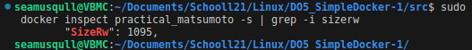 *Размер запущенного контейнера* 

- Останови докер образ через `docker stop [container_id|container_name]`.

- Проверь, что образ остановился через `docker ps -a`.

>Видим через команду что контейнер был остановлен 11 секунд назад и запущенных контейнеров нет

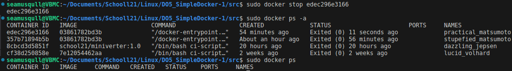 *Останавливаем контейнер и посмотрим в каком статусе находяться контейнеры* 

- Запусти докер с портами 80 и 443 в контейнере, замапленными на такие же порты на локальной машине, через команду run.

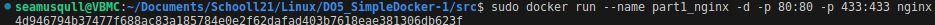 *запускаем контейнер и открываем ему порты* 

- Проверь, что в браузере по адресу localhost:80 доступна стартовая страница nginx.

 *в контейнере nginx уже работает поэтому можем ввести в браузере локалхост 80* 

- Перезапусти докер контейнер через docker restart [container_id|container_name].

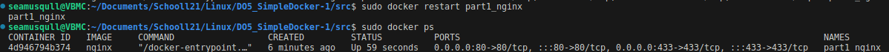 *Перезапускаем контейнер и проверяем работающие контейнеры* 

 *перезапустив контейнер также можно проверить что страничка nginx  также работает* 

[Вернуться к содержанию](#содержание)

## Part 2. Операции с контейнером

- Прочитай конфигурационный файл *nginx.conf* внутри докер контейнера через команду *exec*.

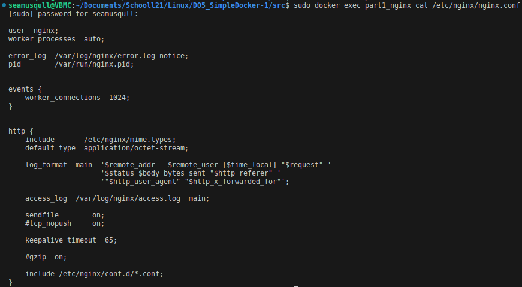 *Читаем файл* 

- Создай на локальной машине файл *nginx.conf*.

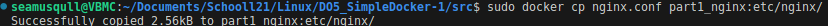 *Копируем данные из терминала в файл к себе на машину* 

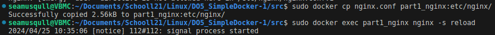 *Копируем файл в докер* 

- Настрой в нем по пути */status* отдачу страницы статуса сервера **nginx**.
- Скопируй созданный файл *nginx.conf* внутрь докер-образа через команду `docker cp`.

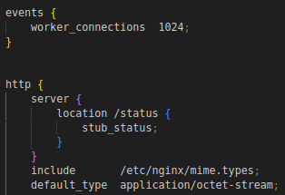

- Перезапусти **nginx** внутри докер-образа через команду *exec*.

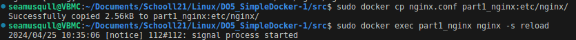 *копируем файл и перезапускаем службу 

- Проверь, что по адресу *localhost:80/status* отдается страничка со статусом сервера **nginx**.

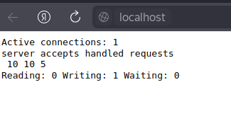 *страничка запускаеться* 

- Экспортируй контейнер в файл *container.tar* через команду *export*.
- Останови контейнер.

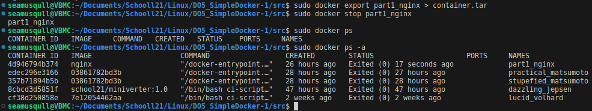 *экспортируем контейнер и останавливаем его* 

- Удали образ через `docker rmi [image_id|repository]`, не удаляя перед этим контейнеры.

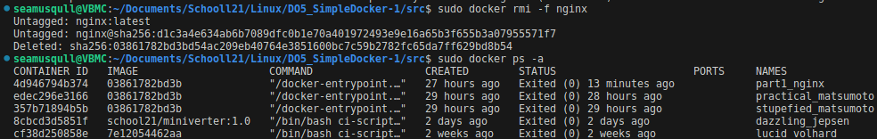 *Принудительно удаляем образ* 

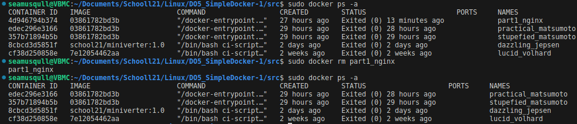

- Удали остановленный контейнер.
- Импортируй контейнер обратно через команду *import*.

* Даю указание полученному образу собраться с выключенным демоном иначе сборка завершиться некоректно 
`sudo docker import -c 'cmd ["nginx", "-g", "daemon off;"]' ./container.tar part1_to_pa
rt2:latest`

- Запусти импортированный контейнер.

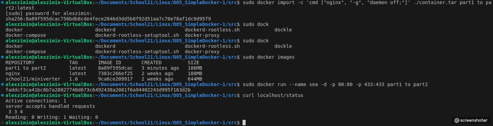 *Импортирую контейнер запускаю его смотрю вывод локалхост статус* 

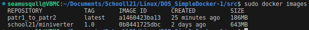 *контейнер запущен* 

- Проверь, что по адресу *localhost:80/status* отдается страничка со статусом сервера **nginx**.

 *СТраничка запускаеться* 

[Вернуться к содержанию](#содержание)

## Part 3. Мини веб-сервер

`sudo apt-get update -y`

`sudo apt-get install -y libfcgi-dev`

`sudo apt install spawn-fcgi`

- Напиши мини-сервер на C и FastCgi, который будет возвращать простейшую страничку с надписью Hello World!.

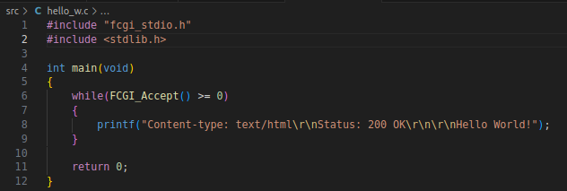 *пишем страничку* 

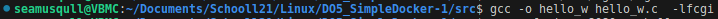 *Компилируем* 

- Запусти написанный мини-сервер через spawn-fcgi на порту 8080.
- Напиши свой nginx.conf, который будет проксировать все запросы с 81 порта на 127.0.0.1:8080.

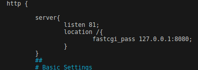 *прописываем порты в конфиг* 

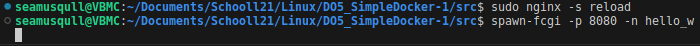 *перезапускаем nginx и запускаем спавн* 

- Проверь, что в браузере по localhost:81 отдается написанная тобой страничка.

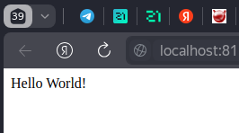 *открываем в браузере нашу страничку* 

- Положи файл nginx.conf по пути ./nginx/nginx.conf (это понадобится позже).

[Вернуться к содержанию](#содержание)

## Part 4. Свой докер

`sudo docker build -t sea:part4 .`

`sudo docker run --name sea -ti -p 80:81 sea:part4`

- Напиши свой докер-образ, который:
##### 1) собирает исходники мини сервера на FastCgi из [Части 3](#part-3-мини-веб-сервер);
##### 2) запускает его на 8080 порту;
##### 3) копирует внутрь образа написанный *./nginx/nginx.conf*;
##### 4) запускает **nginx**.

 *Пропишем докер файл* 

- Собери написанный докер-образ через `docker build` при этом указав имя и тег.

 *Собираем образ* 

- Проверь через `docker images`, что все собралось корректно.

 *Образ собрался* 

- Запусти собранный докер-образ с маппингом 81 порта на 80 на локальной машине и маппингом папки *./nginx* внутрь контейнера по адресу, где лежат конфигурационные файлы **nginx**'а (см. [Часть 2](#part-2-операции-с-контейнером)).

 *Запускаем, с мапингом портов и папки 

- Проверь, что по localhost:80 доступна страничка написанного мини сервера.

 *Пишем в браузер локал хост* 

- Допиши в *./nginx/nginx.conf* проксирование странички */status*, по которой надо отдавать статус сервера **nginx**.

 *Допишем статус сервера* 

- Перезапусти докер-образ.

 *Перезапустим контейнер* 

*Если всё сделано верно, то, после сохранения файла и перезапуска контейнера, конфигурационный файл внутри докер-образа должен обновиться самостоятельно без лишних действий*
- Проверь, что теперь по *localhost:80/status* отдается страничка со статусом **nginx**

 *Пишем в браузер локал хост статус* 

[Вернуться к содержанию](#содержание)

## Part 5. **Dockle**

- Просканируй образ из предыдущего задания через `dockle [image_id|repository]`.

 *Проверим образ части 4й* 

- Исправь образ так, чтобы при проверке через **dockle** не было ошибок и предупреждений.

* Нужно исправить две базовые ошибки со статусом **FATAL** и  **WARN**

 *Исправим докер файл* 

* Основная ошибка содержиться в Докерфайле по скольку при создании образа все папки создаются от рута то доступа к ним будучи пользователем у меня нет я даже не могу посмотреть сожержимое некоторых папок.
* Что интересно пользователь уже имееться nginx, тоесть мне нужно будучи под рутом дать доступ юзеру nginx к ключевым папкам которые позволяют запускать сервер и остальные файлы которые я закинул через докер файл, и если я зайду под пользователем и запущу `spawn-fcgi -p 8080 ./hello_w` страничка заработет.
* Я укажу пользователя nginx  проведу основые манипуляции от его имени и WARN пропадет.

* Фатальная ошибка завязана на безопасность сервера nginx и безопасной передачи данных, если я рабатаю на стационарной машине то все ключи у меня обновлены и не требует какого либо вмешательства, например я мог бы настроить время жизни нынешнего ключа например месяц и по истечению этого времени вручную его обновить, тем самым отрезав доступ злоумышленику получившим мой GPGKEY.
* Но в образе этого не происходит, поэтому можно показать dockle  что ключ не нуждаеться в обновлении:

`sudo dockle -ak NGINX_GPGKEY -ak NGINX_GPGKEY_PATH sea:part5`

 *Пересобираю образ* 

 *Ошибок нет* 

[Вернуться к содержанию](#содержание)

## Part 6. Базовый **Docker Compose**

>Docker-compose — это надстройка над Docker, приложение на Python, которое позволяет запускать множество контейнеров одновременно и маршрутизировать потоки данных между ними.

- Напиши файл *docker-compose.yml*

* Записывая в ямлфайл название контейнера и образ с которым собираемся работать я посути написал докер файл
в котором сказал создай контейнер с именем "океан" на образе "nginx", открой порты и скопируй конфиг в этот контейнер

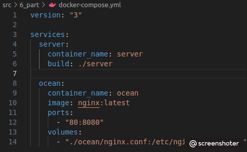 *Запишем ямл файл* 

- Замапь 8080 порт второго контейнера на 80 порт локальной машины.

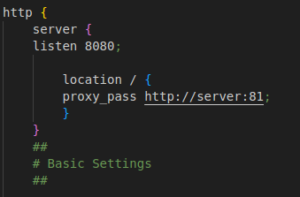 *nginx  для второго контейнера с именем ocean* 

- Останови все запущенные контейнеры.
- Собери и запусти проект с помощью команд `docker-compose build` и `docker-compose up`.

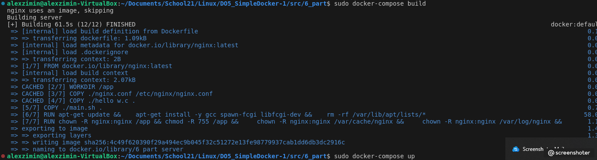 *билдим компос* 

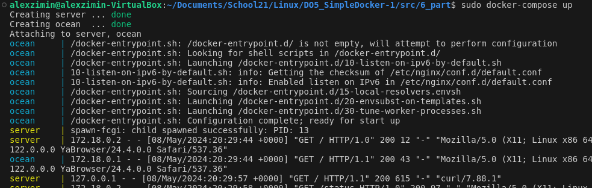 *запускаем* 

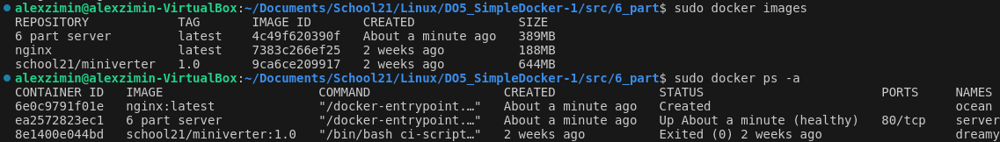 *смотрим что образы и контейнеры созданы* 

- Проверь, что в браузере по *localhost:80* отдается написанная тобой страничка, как и ранее.

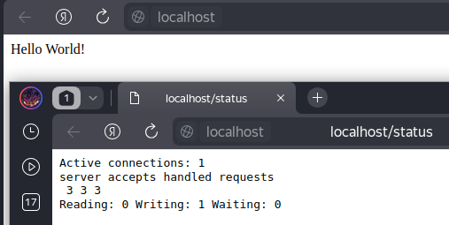 *сервер на запрос отвечает* 

[Вернуться к содержанию](#содержание)