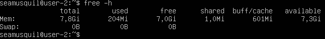
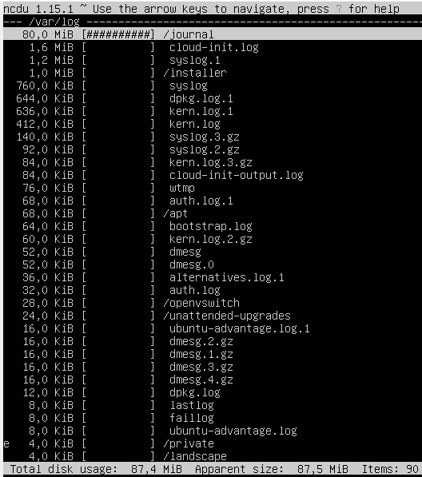

## Part 1. Установка ОС

**== Задание ==**

##### Установить **Ubuntu 20.04 Server LTS** без графического интерфейса.

**== Выполнение ==**

* Скачиваем образ **Ubuntu 20.04 server LTS** 
* Ставим образ на **VirtualBox**
* Результат выполненого запроса `cat /etc/issue` внутри получившейся виртуальной машины  
 *Версия Ubuntu* 

 

## Part 2. Создание пользователя

**== Задание ==**

##### Создать пользователя, отличного от пользователя, который создавался при установке. Пользователь должен быть добавлен в группу `adm`.

**== Выполнение ==**

* Выполняем команды `sudo adduser tom` для создания нового пользователя

* Выполняем команды `sudo usermod -aG adm tom` для добавления его в группу `adm`

* Для проверки успеха выполнения задания выполняем `vim /etc/group`, что позволит посмотреть появился ли новый пользователь в группе `adm`  
 *Группа adm* 
* Новый пользователь должен быть в выводе команды `cat /etc/passwd`  
 *вывод passwd* 

 

## Part 3. Настройка сети ОС

Cетевые интерфейсы и DHCP.

**== Задание 1 ==**

##### Задать название машины вида user-1  

**== Выполнение ==**

* Выполняем команду `sudo hostnamectl set-hostname user-1`

* Выполняя `cat /etc/hostname` проверяем результат

 *Результат смены имени машины* 

 

**== Задание 2 ==**

##### Установить временную зону, соответствующую вашему текущему местоположению.  

**== Выполнение ==**

* Выполняем команду `sudo timedatectl set-timezone Europe/Moscow`

* Проверяем результат, выполнив `timedatectl`

 *Результат установки системного времени* 

 

**== Задание 3 ==**

##### Вывести названия сетевых интерфейсов с помощью консольной команды.
- В отчёте дать объяснение наличию интерфейса lo.  

**== Выполнение ==**
* **lo (loopback device)** – виртуальный интерфейс, присутствующий по умолчанию в любом Linux. Он используется для отладки сетевых программ и запуска серверных приложений на локальной машине. С этим интерфейсом всегда связан адрес 127.0.0.1. У него есть dns-имя – localhost. Посмотреть привязку можно в файле /etc/hosts.

* Выполняем команду `ls /sys/class/net` для отображения сетевых интерфейсов

 *Результат выполнения команды* 

 

**== Задание 4 ==**

##### Используя консольную команду получить ip адрес устройства, на котором вы работаете, от DHCP сервера. 
- В отчёте дать расшифровку DHCP.  

**== Выполнение ==**

* **DHCP** — протокол прикладного уровня модели TCP/IP, служит для назначения IP-адреса клиенту. Это следует из его названия — Dynamic Host Configuration Protocol. IP-адрес можно назначать вручную каждому клиенту, то есть компьютеру в локальной сети. Но в больших сетях это очень трудозатратно, к тому же, чем больше локальная сеть, тем выше возрастает вероятность ошибки при настройке. Поэтому для автоматизации назначения IP был создан протокол DHCP.

* Выполняем команду `ip r` для получения ip-адреса от DHCP сервера

 *Результат выполнения команды* 

 

**== Задание 5 ==**

##### Определить и вывести на экран внешний ip-адрес шлюза (ip) и внутренний IP-адрес шлюза, он же ip-адрес по умолчанию (gw). 

**== Выполнение ==**

* Выполняем команду `wget -qO- eth0.me` для вывода внешнего ip шлюза, и `ip route | grep default` для вывода внутреннего

 *Внешний ip-адрес шлюза (ip) и внутренний IP-адрес шлюза* 

 

**== Задание 6 ==**

##### Задать статичные (заданные вручную, а не полученные от DHCP сервера) настройки ip, gw, dns (использовать публичный DNS серверы, например 1.1.1.1 или 8.8.8.8).  

**== Выполнение ==**

* Меняем доступ к файлу для дальнейшего его редактирования `sudo chmod 777 /etc/netplan/00-installer-config.yaml`

* Редактируем файл под нужные настройки используя `vim /etc/netplan/00-installer-config.yaml` 

 *Итоговые параметры в файле* 

* Сохраняем изменения командой `sudo netplan apply`

 

**== Задание 7 ==**

##### Перезагрузить виртуальную машину. Убедиться, что статичные сетевые настройки (ip, gw, dns) соответствуют заданным в предыдущем пункте.  
- Успешно пропинговать удаленные хосты 1.1.1.1 и ya.ru и вставить в отчёт скрин с выводом команды. В выводе команды должна быть фраза "0% packet loss".

**== Выполнение ==**

* Перезапускаем машину командой `reboot`
* Пингуем командой `ping -c 4 1.1.1.1`
* Затем командой `ping -c 4 ya.ru`

 *Вывод команды* 

 

## Part 4. Обновление ОС

**== Задание ==**

##### Обновить системные пакеты до последней на момент выполнения задания версии.  

- После обновления системных пакетов, если ввести команду обновления повторно, должно появится сообщение, что обновления отсутствуют.
- Вставить скриншот с этим сообщением в отчёт.

**== Выполнение ==**

* Выполняем команду `sudo apt update` для получения доступных пакетов

* Обновляем системные пакеты до последней версии командой `sudo apt full-upgrade`

* Запускаем команду обновления ещё раз

 *Результат повторного запуска обновления* 

 

## Part 5. Использование команды **sudo**

**== Задание ==**

##### Разрешить пользователю, созданному в [Part 2](#part-2-создание-пользователя), выполнять команду sudo.

- В отчёте объяснить назначение команды sudo.  
- Поменять hostname ОС от имени пользователя, созданного в пункте [Part 2](#part-2-создание-пользователя) (используя sudo).
- Вставить скрин с изменённым hostname в отчёт.

**== Выполнение ==**

* Sudo (su «do») позволяет системному администратору делегировать полномочия, чтобы дать определенным пользователям (или группам пользователей) возможность запускать некоторые (или все) команды от имени пользователя root или другого пользователя, обеспечивая контрольный журнал команд и их аргументов.

* Командой `sudo usermod -a -G sudo tom` разрешаем пользователю использовать sudo

* Командой `su - tom` меняем пользователя

* Меняем hostname под другим пользователем `sudo hostnamectl set-hostname user-2` 

* `cat /etc/hostname` смотрим результат

 *Результат выполнения команд* 

 

## Part 6. Установка и настройка службы времени

**== Задание ==**

##### Настроить службу автоматической синхронизации времени.  

- Вывести время часового пояса, в котором вы сейчас находитесь.
- Вывод следующей команды должен содержать `NTPSynchronized=yes`: \
  `timedatectl show`
- Вставить скрины с корректным временем и выводом команды в отчёт.

**== Выполнение ==**

* Проверяем время которое установлено в данный момент командой `timedatectl`

 *Установленое сейчас время* 

* Установливаем временную зону`sudo timedatectl set-timezone Europe/Moscow`

* Вывод команды `timedatectl show`

 *time* 

 

## Part 7. Установка и использование текстовых редакторов 

**== Задание 1 ==**

##### Установить текстовые редакторы **VIM**, **NANO**, **mcedit**.  

**== Выполнение ==**

* Используя команду `sudo apt install mcedit` устанавливаем текстовый редактор mcedit

 

**== Задание 2 ==**

##### Используя каждый из трех выбранных редакторов, создайте файл *test_X.txt*, где X -- название редактора, в котором создан файл. Напишите в нём свой никнейм, закройте файл с сохранением изменений.  

- В отчёт вставьте скриншоты:
  - Из каждого редактора с содержимым файла перед закрытием.
- В отчёте укажите, что сделали для выхода с сохранением изменений.

**== Выполнение ==**

**VIM** 

* Создаем файл с помощью команды `vim test_vim.txt`

* Нажимаем "i" для перехода в режим редактирования

* Пишем ник: "seamusqu"

Для выхода с сохранением нажимем `Esc` вводим команду `:wq` и нажимаем `Enter`

 *vim* 

 

**NANO**

* Создаем файл с помощью команды `nano test_nano.txt`

* Пишем ник: "seamusqu"

* Для выхода нажимаем комбинацию `ctrl+x` для сохранения вводим `Y` и нажимаем`Enter`

 *nano* 

 

**MCEDIT**

* Cоздаем файл с помощью команды `mcedit test_mcedit.txt`

* Пишем ник: "seamusqu"

* Для выхода с сохранением нажимаем `Esc`, а затем клавишу `YES`

 *mcedit* 

**== Задание 3 ==**

##### Используя каждый из трех выбранных редакторов, откройте файл на редактирование, отредактируйте файл, заменив никнейм на строку "21 School 21", закройте файл без сохранения изменений.
- В отчёт вставьте скриншоты:
    - Из каждого редактора с содержимым файла после редактирования.
- В отчёте укажите, что сделали для выхода без сохранения изменений.

**== Выполнение ==**

**VIM**

* Открываем файл с помощью команды `vim test_vim.txt`

* Нажимаем "i" для перехода в режим редактирования

* Изменяем ник на "21 School 21"

* Для выхода без сохранения нажимаем `Esc` вводим команду `:q!` и нажимаем `Enter`

 *VIM* 

**NANO**

* Открываем файл с помощью команды `nano test_nano.txt`

* Изменяем ник на "21 School 21"

* Для выхода без сохранения нажимаем комбинацию `ctrl+x`, потом `N`

 *NANO* 

**MCEDIT**

* Открываем файл с помощью команды `mcedit test_mcedit.txt`.

* Изменяем ник на "21 School 21"

* Для выхода без сохранения нажимаем `Esc`, а затем `No`

 *mcedit* 

 

**== Задание 4 ==**

##### Используя каждый из трех выбранных редакторов, отредактируйте файл ещё раз (по аналогии с предыдущим пунктом), а затем освойте функции поиска по содержимому файла (слово) и замены слова на любое другое.
- В отчёт вставьте скриншоты:
    - Из каждого редактора с результатами поиска слова.
    - Из каждого редактора с командами, введёнными для замены слова на другое.

**== Выполнение ==**

**VIM**

* Открываем файл с помощью команды `vim test_vim.txt`

* Для поиска в VIM вводим `/seamusqu` и искомое слово выделяется в самом редакторе

 *vim* 

* Для замены слова в VIM вводим `:%s/seamusqu/21 School 21` и слово "seamusqu" заменяется на "21 School 21"

 *vim* 

 

**NANO**

* Открываем файл с помощью команды `nano test_nano.txt`

* Для поиска в NANO вводим `ctrl + W`

 *nano* 

* Для замены слова в NANO вводим `ctrl + \`, пишем "seamusqu", нажимаем `Enter`, пишем "21 School 21", нажимаем `Enter`, выбираем `Y`

 *nano* 

 

**MCEDIT**

* Открываем файл с помощью команды `mcedit test_mcedit.txt`

* Для поиска в mcedit вводим `F7`, затем вводим слово, которое хотим найти, оно выделяется зеленым

 *mcedit* 

* Для замены слова в mcedit жмем `F4`, затем вводим "seamusqu", нажимаем стрелку вниз, пишем "21 School 21"

 *mcedit* 

 

## Part 8. Установка и базовая настройка сервиса **SSHD**

**== Задание ==**

##### Установить службу SSHd.  
##### Добавить автостарт службы при загрузке системы.  
##### Перенастроить службу SSHd на порт 2022.  
##### Используя команду ps, показать наличие процесса sshd. Для этого к команде нужно подобрать ключи.
- В отчёте объяснить значение команды и каждого ключа в ней.
##### Перезагрузить систему.
- В отчёте опишите, что сделали для выполнения всех пяти пунктов (можно как текстом, так и скриншотами).
- Вывод команды netstat -tan должен содержать  \
`tcp 0 0 0.0.0.0:2022 0.0.0.0:* LISTEN`  \
(если команды netstat нет, то ее нужно установить)
- Скрин с выводом команды вставить в отчёт.
- В отчёте объяснить значение ключей -tan, значение каждого столбца вывода, значение 0.0.0.0.

**== Выполнение ==**

* Проверяем наличие SSHd командой `ssh -V`

 *Служба SSHd* 

* Добавляем автостарт службы SSHd командой `sudo systemctl enable ssh`

 *автозапуск установлен* 

* Открываем config `sudo nano /etc/ssh/sshd_config`

* Изменяем порт SSHd: добавляем строку `Port 2022`

 *Изменёный config* 

* Используем команду `/etc/init.d/ssh restart` для того что бы изменения вступили в силу

 *Вывод команды* 

Используем команду `ps -F | grep sshd` для проверки наличия процесса

 *SSHd процесс* 

* Команда `ps` показывает текущие процессы на сервере. 

* Команда `grep` позволяет выдилить нужную нам информацию по процессам

* флаг -F выводит максимум доступных данных

 

* Устанавливаем *net-tools* `sudo apt install net-tools`

* Выполняем команду `netstat -tan`

 *Выполнение команды netstat -tan* 

* Опция -a показывает состояние всех сокетов

* -n показывает ip адрес, а не сетевое имя

* -t показывает только tcp соединения

* Proto - протокол, используемый сокетом

* Recv-Q - количество байтов, не скопированных пользовательской программой, подключенной к этому сокету

* Local Adbress - локальный адрес (имя локального хоста) и номер порта сокета

* Foreign Adbress - удаленный адрес (имя удаленного хоста) и номер порта сокета

* State - состояние сокета

* 0.0.0.0 в выводе netstat означает, что ssh daemon прослушивает все интерфейсы IPv4, которые есть у машины

* Перезагружаем систему командой `sudo reboot`

 

## Part 9. Установка и использование утилит **top**, **htop**

**== Задание ==**

##### Установить и запустить утилиты top и htop.  

- По выводу команды top определить и написать в отчёте:
  - uptime
  - количество авторизованных пользователей
  - общую загрузку системы
  - общее количество процессов
  - загрузку cpu
  - загрузку памяти
  - pid процесса занимающего больше всего памяти
  - pid процесса, занимающего больше всего процессорного времени
- В отчёт вставить скрин с выводом команды htop:
  - отсортированному по PID, PERCENT_CPU, PERCENT_MEM, TIME
  - отфильтрованному для процесса sshd
  - с процессом syslog, найденным, используя поиск 
  - с добавленным выводом hostname, clock и uptime

**== Выполнение ==**

* Командой `top` запускаем соответствующую утилиту

 *Запуск top* 

* uptime - top 19:08:10  

* количество авторизированных пользователей 1 user  

* общая загрузка системы - load avarage  

* общее количество процессов Tasks: 128  

* загрузка cpu - s(CPU): ... 

* загрузка памяти - MiB Mem 

* pid процесса, занимающего больше всего памяти строка  root 1  

* pid процесса, занимающего больше всего процессорного времени root 16  

* Жмем `q` для выхода из top

 

*  командой `htop` запускаем утилиту

 *Запуск htop* 

* Для выбора того как проводить сортировку мы нажимаем `F6`

* PID  
 *PID* 

* PERCENT_CPU  
 *PERCENT_CPU* 
 
* PERCENT_MEM  
 *PERCENT_MEM* 

* TIME  
 *TIME* 

* Для работы с фильтром нажимаем `F4`

* После мы вводим `SShd` и нажимаем `Enter`

* фильтр по SSHd  
 *SSHd* 

* Для работы с поиском нажимаем `F3`

* После мы вводим `syslog` и нажимаем `Enter`

* Результат поиска  
 *Поиск syslog* 

* Выход `F10`

 

## Part 10. Использование утилиты **fdisk**

**== Задание ==**

##### Запустить команду fdisk -l.

- В отчёте написать название жесткого диска, его размер и количество секторов, а также размер swap.

**== Выполнение ==**

* Запуск утилиты командой `sudo fdisk -l`

 *Вывод команды* 

* Название жесткого диска `Disk model - VBOX HARDDISK`   

* Размер `Disk dev/swa/ 20 GiB` 

* Количество секторов - `41943040 sectors` 

* Используем команду `free -h` для определения размера swap:  

 

## Part 11. Использование утилиты **df** 

**== Задание 1 ==**

##### Запустить команду df.  
- В отчёте написать для корневого раздела (/):
  - размер раздела
  - размер занятого пространства
  - размер свободного пространства
  - процент использования
- Определить и написать в отчёт единицу измерения в выводе.  

**== Выполнение ==**
* используем команду `df /`  
 *Вывод команды* 
    
* Размер раздела - 1K-Blocks 

* Размер занятого пространства - Used  

* Размер свободного пространства - Avalable 

* Процент использования Use% 

* Единица измерения: Кб

**== Задание 2 ==**

##### Запустить команду df -Th.
- В отчёте написать для корневого раздела (/):
    - размер раздела
    - размер занятого пространства
    - размер свободного пространства
    - процент использования
- Определить и написать в отчёт тип файловой системы для раздела.

**== Выполнение ==**

* используем команду `df -Th /`  
 *Вывод команды* 

* Тип файловой системы для раздела - Type ext4  

* Размер раздела - Size 9,8G  

* Размер занятого пространства - Used 4.0G  

* Размер свободного пространства - Aval  5.3G 

* Процент использования - Use% 44%  

 

## Part 12. Использование утилиты **du**

**== Задание ==**

##### Запустить команду du.
##### Вывести размер папок /home, /var, /var/log (в байтах, в человекочитаемом виде)
##### Вывести размер всего содержимого в /var/log (не общее, а каждого вложенного элемента, используя *)

- В отчёт вставить скрины с выводом всех использованных команд.

**== Выполнение ==**

* Запуcк команды `du`  
 *Вывод команды* 

* С помощью команды `sudo du -s /home && sudo du -s /var && sudo du -s /var/log` выводим размер папок в битах 
 *Размер папок* 

* С помощью команды `sudo du -s -h /home && sudo du -s -h /var && sudo du -s -h /var/log` выводим размер папок в человекочитаемом виде 
 *Размер папок* 
    
* Вывести размер элементов `/var/log` с помощью команды `sudo du -h /var/log*`  
 *Размер элементов* 

 

## Part 13. Установка и использование утилиты **ncdu**

**== Задание ==**

##### Установить утилиту ncdu.
##### Вывести размер папок /home, /var, /var/log.

- Размеры должны примерно совпадать с полученными в [Part 12](#part-12-использование-утилиты-du).

- В отчёт вставить скрины с выводом использованных команд.

**== Выполнение ==**

* Командой `sudo apt install ncdu` устанавливаем ncdu

* Вывести размер папок с помощью команды `sudo ncdu` /home, /var, /var/log

 */home* 

 */var* 

 */var/log* 

 

## Part 14. Работа с системными журналами

**== Задание ==**

##### Открыть для просмотра:
##### 1. /var/log/dmesg
##### 2. /var/log/syslog
##### 3. /var/log/auth.log  

- Написать в отчёте время последней успешной авторизации, имя пользователя и метод входа в систему.
- Перезапустить службу SSHd.
- Вставить в отчёт скрин с сообщением о рестарте службы (искать в логах).

**== Выполнение ==**

* Просмотр `vim /var/log/dmesg`  

* Просмотр `vim /var/log/syslog`  

* Просмотр `vim /var/log/auth.log`  

    
* Для просмотра последней авторизации, имени пользователя и метода входа в систему используем команду `last`  
 *Результат работы команды* 

* Время авторизации Feb 3 16:37
* Имя пользователя seamusquil
* Метод входа в систему tty1

* Командой `service sshd restart` перезапускаем службу SSHd

 *Результат работы команды* 

* Командой `sudo cat /var/log/syslog` выводим сообщение о рестарте служб
 *Результат работы команды* 

 

## Part 15. Использование планировщика заданий **CRON**

**== Задание ==**

##### Используя планировщик заданий, запустите команду uptime через каждые 2 минуты.
- Найти в системных журналах строчки (минимум две в заданном временном диапазоне) о выполнении.
- Вывести на экран список текущих заданий для CRON.
- Вставить в отчёт скрины со строчками о выполнении и списком текущих задач.

##### Удалите все задания из планировщика заданий.
- В отчёт вставьте скрин со списком текущих заданий для CRON.

**== Выполнение ==**

* Используем команду `sudo apt install cron` для установки **CRON**

* Планируем задачу командой `crontab -e`

* В vim приписываем `"*/2 * * * * uptime"`

 *uptime* 

* Командой `crontab -l` выводим список установленых задач

 *Список текущих заданий* 

* Командой `grep -i cron /var/log/syslog` выводим системных задач

 *Системный журнал* 

* Командой `crontab -l` удаляем все запланированые задачи

* Проверяем список задач ещё раз

 *Системный журнал* 

 