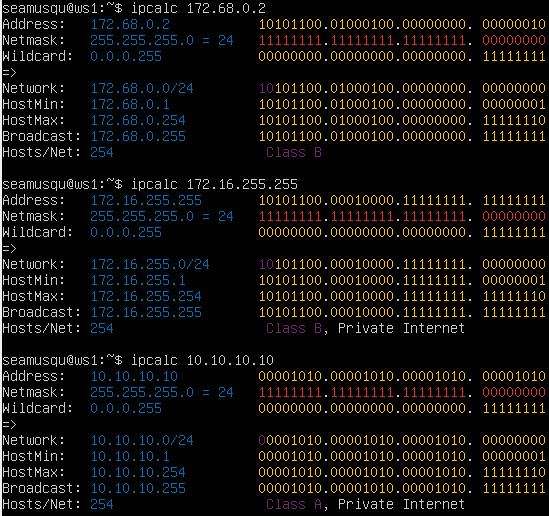
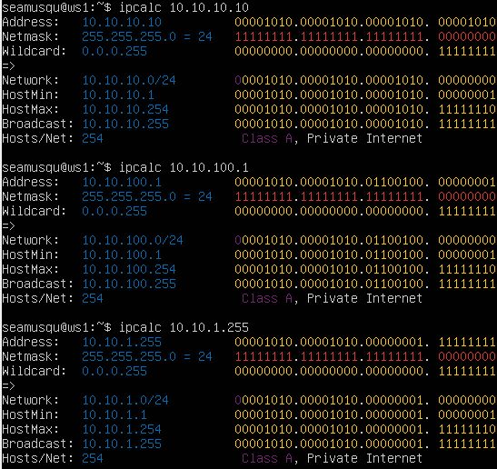
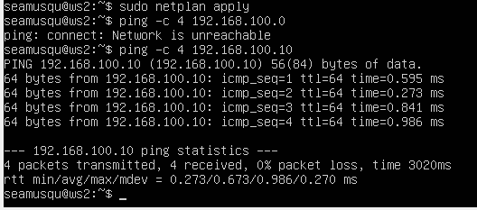
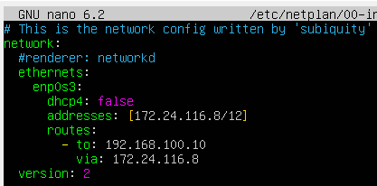

# Сети в Linux

# Содержание

1. [Инструмент ipcalc](#part-1-инструмент-ipcalc)
2. [Статическая маршрутизация между двумя машинами](#part-2-статическая-маршрутизация-между-двумя-машинами)
3. [Утилита iperf3](#part-3-утилита-iperf3)
4. [Сетевой экран](#part-4-сетевой-экран)
5. [Статическая маршрутизация сети](#part-5-статическая-маршрутизация-сети)
6. [Динамическая настройка IP с помощью DHCP](#part-6-динамическая-настройка-ip-с-помощью-dhcp)
7. [NAT](#part-7-nat)
8. [Допополнительно. Знакомство с SSH Tunnels](#part-8-дополнительно-знакомство-с-ssh-tunnels)

## Part 1 Инструмент ipcalc

      - 1.1 Сети и маски
      - 1.2 localhost
      - 1.3 Диапазоны и сегменты сетей

[Вернуться к содержанию](#содержание)

### 1.1 Сети и маски

- Версия Ubuntu просле выполнения команды `cat /etc/issue` для ws1.
- Устанавливаем ipcalc на наш компьютер `sudo apt install ipcalc` и проверяем версию  `ipcalc -v`  

*************************************************************************************************************************
- Определение адреса сети 192.167.38.54/13: `ipcalc 192.167.38.54/13` 

> Результат выполнения команды `ipcalc 192.167.38.54/13`
*************************************************************************************************************************
- Для перевода маски 255.255.255.0 в префиксную и двоичную запись выполним команду: `ipcalc 255.255.255.0`

> Перевод маски 255.255.255.0 в префиксную и двоичную запись
*************************************************************************************************************************
- Для перевода /15 в обычную и двоичную запись выполним команду: `ipcalc /15`  

> Перевод маски /15 в обычную и двоичную запись
*************************************************************************************************************************
- Для перевода 11111111.11111111.11111111.11110000 в обычную и префиксную запись выполним команду: `ipcalc 255.255.255.240`

> Перевод 11111111.11111111.11111111.11110000 в обычную и префиксную запись
*************************************************************************************************************************
- Минимальный и максимальный хост в сети 12.167.38.4 при маске: /8  `ipcalc 12.167.38.4/8`

>Минимальный хост 12.0.0.1. Максимальный хост: 12.255.255.254
*************************************************************************************************************************
- Минимальный и максимальный хост в сети 12.167.38.4 при маске: 11111111.11111111.00000000.00000000 `ipcalc 12.167.38.4/255.255.0.0` 

>Минимальный хост 12.0.0.1. Максимальный хост: 12.255.255.254
*************************************************************************************************************************
- Минимальный и максимальный хост в сети 12.167.38.4 при маске: 255.255.254.0 `ipcalc 12.167.38.4/255.255.254.0`

>Минимальный хост 12.167.38.1. Максимальный хост: 12.167.39.254
*************************************************************************************************************************
- Минимальный и максимальный хост в сети 12.167.38.4 при маске: /4 `ipcalc 12.167.38.4/4`

>Минимальный хост 0.0.0.1. Максимальный хост: 15.255.255.254
*************************************************************************************************************************

[Вернуться к содержанию](#содержание)

### 1.2 localhost

- Определяем, можно ли обратиться к приложению, работающему на localhost, со следующими IP: 194.34.23.100, 127.0.0.2, 127.1.0.1, 128.0.0.1 с помощью команды `ping -c 1` 

>Можно обратиться к 127.0.0.2 и 127.1.0.1. Пакеты с IP 194.34.23.100 и 128.0.0.1 - 100% packet loss
*************************************************************************************************************************
[Вернуться к содержанию](#содержание)

### 1.3 Диапазоны и сегменты сетей

- Определяем публичные и частные ip 10.0.0.45, 134.43.0.2, 192.168.4.2, 172.20.250.4, 172.0.2.1, 192.172.0.1, 172.68.0.2, 172.16.255.255, 10.10.10.10, 192.169.168.1 с помощью ipcalc  
      

> Частные 10.0.0.45, 192.168.4.2, 172.20.250.4, 172.16.255.255, 10.10.10.10. Остальные публичные.
*************************************************************************************************************************
- Определим какие из перечисленных IP адресов шлюза возможны у сети 10.10.0.0/18: 10.0.0.1, 10.10.0.2, 10.10.10.10, 10.10.100.1, 10.10.1.255
  

> Из перечисленных IP-адресов шлюза, только 10.10.0.2 и 10.10.1.255 возможны для сети 10.10.0.0/18. 10.0.0.1, 10.10.10.10 и 10.10.100.1 не входят в диапазон адресов данной сети. 
*************************************************************************************************************************
[Вернуться к содержанию](#содержание)

## Part 2 Статическая маршрутизация между двумя машинами

      - 2.1 Добавление статического маршрута вручную
      - 2.2. Добавление статического маршрута с сохранением

- Создаём ws2.
- Проверяем версию машину.

>Версия Ubuntu, выполнения команды `cat /etc/issue` для ws2. 

*************************************************************************************************************************
- Выполним ip -a для ws1 и ws2 
 

>Результат выполнения ip -a для ws1 и ws2
*************************************************************************************************************************
- Изменим файлы etc/netplan/00-installer-config.yaml, пропишем IP для ws1 и ws2 и выполним netplan apply для перезапуска сервиса сети
 
 *netplan.yaml двух машин* 

 
 *netplan apply* 

>Скрины с содержанием изменённого файла etc/netplan/00-installer-config.yaml для для ws1 и ws2 и выполненной команды netplan apply 
*************************************************************************************************************************
[Вернуться к содержанию](#содержание)

### 2.1. Добавление статического маршрута вручную
- Добавим статический маршрут от одной машины до другой и обратно при помощи команды вида ip r add

>Скрины `ip r add` и ping ws1->ws2 и ws2->ws1

 *ws1->ws2* 

 *ws2->ws1* 

- Пропингуем соединение между машинами

 *ws1->ws2* 

 *ws2->ws1* 

[Вернуться к содержанию](#содержание)

### 2.2. Добавление статического маршрута с сохранением
- Добавим статический маршрут от одной машины до другой с помощью файла etc/netplan/00-installer-config.yaml командой sudo nano etc/netplan/00-installer-config.yaml

 *ws1 netplan 

 *ws2 netplan 

- Пропингуем соединение

>Скрины добавления статических маршрутов и ping машин
Первое поле указывает, что мы настраиваем сеть, далее указывается версия YAML и рендер, т.е. какой сетевой менеджер будет использоваться, если эта опция не указана, то подразумевается networkd, хотя мы советуем указывать ее явно. Альтернативным значением является NetworkManager, обратите внимание на регистр написания.

>Поле ethernets содержит настройки проводных интерфейсов, в качестве значений выступают поля с именами интерфейсов, которые содержат поля с настройками. Для включения DHCP по протоколу IPv4 используется опция dhcp4, в которой можно указать как true/false, так и yes/no.

>Настройка статического IP-адреса.
В поле dchp4 прописываем значение false, так как мы не используем DHCP. Поле addresses подразумевает список значений, которые заключаются в квадратные скобки и перечисляются через запятую, скобки обязательны, даже если значение одно. (Также можно использовать и альтернативный вариант синтаксиса) Формат записи IP-адреса: адрес/префикс, префикс /24 соответствует маске 255.255.255.0.

>Если требуется указать несколько IP-адресов для одного интерфейса, то запись будет выглядеть так: addresses: [192.168.233.154/24, 192.168.1.154/24]  или addresses: - 192.168.233.154/24 - 192.168.1.154/24

[Вернуться к содержанию](#содержание)

## Part 3 Утилита iperf3

**== Задание ==**

*В данном задании используются виртуальные машины ws1 и ws2 из Части 2*

* 3.1. Скорость соединения
* Переведи и запиши в отчёт: 8 Mbps в MB/s, 100 MB/s в Kbps, 1 Gbps в Mbps.

[Вернуться к содержанию](#содержание)

### 3.1 Скорость соединения

**== Выполнение ==**
Консольная утилита iperf3 предназначена для того, чтобы измерять пропускную способность сети. Она поддерживает работу как по протоколу TCP, так и по UDP. Для проведения тестирования надо запустить iperf3 как на сервере, так и на клиенте. Клиентская часть будет генерировать трафик, а серверная - принимать и отбрасывать.

Переведём: 8 Mbps в MB/s, 100 MB/s в Kbps, 1 Gbps в Mbps

8 Mbps = 1 MB/s         / мегабайт в мегабит
100 MB/s = 800000 Kbps  / мегабайт в килобит
1 Gbps = 1000 Mbps      / гигабит в мегабит

### 3.2. Утилита iperf3

**== Задание ==**

* Измерь скорость соединения между ws1 и ws2.
- В отчёт помести скрины с вызовом и выводом использованных команд.

**== Выполнение ==**
Измерим скорость соединения между ws1 и ws2

- Скачиваем утилиту на машины ws1 и ws2 `sudo apt install iperf3`

- Переводим машину ws1 в режим сервера`iperf3 -s`, можем поключиться к порту 5201

 *запускаем порт и получаем прием с ws2* 

- Запускаем и задаем IP сервера к которому подключемся `iperf3 -c 192.168.100.10 -R`
* `-с` — адрес сервера с запущенным iperf3 на 5201 порту
* `-R` — режим Reverse Mode для тестирования входящей скорости
* Получаем скорость около 3.8 Gbits/sec

 *подключаемся к серверу ws1* 

[Вернуться к содержанию](#содержание)

## Part 4 Сетевой экран

**== Задание ==**

*В данном задании используются виртуальные машины ws1 и ws2 из Части 2*

#### 4.1. Утилита **iptables**

* Создай файл */etc/firewall.sh*, имитирующий фаерволл, на ws1 и ws2:
* Нужно добавить в файл подряд следующие правила:
* 1) На ws1 примени стратегию, когда в начале пишется запрещающее правило, а в конце пишется разрешающее правило (это касается пунктов 4 и 5).
* 2) На ws2 примени стратегию, когда в начале пишется разрешающее правило, а в конце пишется запрещающее правило (это касается пунктов 4 и 5).
* 3) Открой на машинах доступ для порта 22 (ssh) и порта 80 (http).
* 4) Запрети *echo reply* (машина не должна «пинговаться», т.е. должна быть блокировка на OUTPUT).
* 5) Разреши *echo reply* (машина должна «пинговаться»).
- В отчёт помести скрины с содержанием файла */etc/firewall* для каждой машины.
* Запусти файлы на обеих машинах командами `chmod +x /etc/firewall.sh` и `/etc/firewall.sh`.
- В отчёт помести скрины с запуском обоих файлов;
- В отчёте опиши разницу между стратегиями, применёнными в первом и втором файлах.

>Утилита iptables служит для проверки сетевых пакетов. В фильтре iptables все пакеты делятся на три основные цепочки:
input - обрабатывает входящие пакеты и подключения
forward - применяется для проходящих соединений
output - используется для исходящих пакетов и соединений а также существуют две вспомогательные:
prerouting - в эту цепочку пакет попадает перед обработкой iptables, система еще не знает куда он будет отправлен, в input, output или forward;
postrouting - сюда попадают все проходящие пакеты, которые уже прошли цепочку forward.
Для каждого типа пакетов можно установить набор правил, которые по очереди будут проверяться на соответствие с пакетом и если пакет соответствует, то применять к нему указанное в правиле действие. Правила образуют цепочку, поэтому input, output и forward называют цепочками, цепочками правил. Действий может быть несколько:
ACCEPT - разрешить прохождение пакета дальше по цепочке правил;
DROP - удалить пакет;
REJECT - отклонить пакет, отправителю будет отправлено сообщение, что пакет был отклонен;
LOG - сделать запись о пакете в лог файл;
QUEUE - отправить пакет пользовательскому приложению.
Над цепочками правил в iptables есть еще один уровень абстракции, и это таблицы. В системе есть несколько таблиц, и все они имеют стандартный набор цепочек input, forward и output. Таблицы предназначены для выполнения разных действий над пакетами, например для модификации или фильтрации.
raw - предназначена для работы с сырыми пакетами, пока они еще не прошли обработку;
mangle - предназначена для модификации пакетов;
nat - обеспечивает работу nat, если вы хотите использовать компьютер в качестве маршрутизатора;
filter - основная таблица для фильтрации пакетов, используется по умолчанию.
Создать файл /etc/firewall.sh, имитирующий фаерволл, на ws1 и ws2 и добавить в него подряд следующие правила:
-на ws1 применить стратегию когда в начале пишется запрещающее правило, а в конце пишется разрешающее правило (это касается пунктов 4 и 5)
-на ws2 применить стратегию когда в начале пишется разрешающее правило, а в конце пишется запрещающее правило (это касается пунктов 4 и 5)
открыть на машинах доступ для порта 22 (ssh) и порта 80 (http)
запретить echo reply (машина не должна "пинговаться”, т.е. должна быть блокировка на OUTPUT)
разрешить echo reply (машина должна "пинговаться")
Запустить файлы на обеих машинах командами chmod +x /etc/firewall.sh и /etc/firewall.sh
В отчёт поместить скрины с запуском обоих файлов и с содержанием файла /etc/firewall для каждой машины.

**== Выполнение ==**

Командой `sudo nano /etc/firewall.sh` создаем файл в ws1, имитирующий фаерволл и открываем его для редактирования:

 *создаем файл ws1* 

Командой `sudo chmod +x /etc/firewall.sh` даем разрешение на запуск файла:
* `chmod +x`  право на выполнеие файла

Командой `sudo nano /etc/firewall.sh` создаем файл в ws2 и командой `sudo chmod +x /etc/firewall.sh` даем разрешение на запуск файла:

 *создаем файл ws2* 

#### 4.2. Утилита **nmap**

**== Задание ==**

##### Командой **ping** найди машину, которая не «пингуется», после чего утилитой **nmap** покажи, что хост машины запущен.
*Проверка: в выводе nmap должно быть сказано: `Host is up`*.
- В отчёт помести скрины с вызовом и выводом использованных команд **ping** и **nmap**.

##### Сохрани дампы образов виртуальных машин
**P.S. Ни в коем случае не сохраняй дампы в гит!**

**== Выполнение ==**

Находим машину которая не пингуется с машины ws1 пингуем ws2 и наоборот:

Вводим команду `ping -c 3 192.168.100.10`

 *пингуем машину ws2* 

Вводим команду `ping -c 1 172.24.116.8`

 *пингуем машину ws1* 

Машина ws1 не пингуется, на машине ws2 запускаем утилиту nmap с пингом машины ws1

 *вводим команду nmap 192.168.100.10* 

Видим результат `Host is up` хост запущен.

Делаем снимки виртуальных машин

 *снимки машин* 

[Вернуться к содержанию](#содержание)

## Part 5. Статическая маршрутизация сети

**== Задание 5.0 ==**

* Поднять пять виртуальных машин (3 рабочие станции (ws11, ws21, ws22) и 2 роутера (r1, r2))

 *Схема подключения машин* 

**== Выполнение ==**

 *VirtualBox* 

 

**== Задание 5.1 ==**

#### 5.1. Настройка адресов машин
##### Настроить конфигурации машин в *etc/netplan/00-installer-config.yaml* согласно сети на рисунке.
- В отчёт поместить скрины с содержанием файла *etc/netplan/00-installer-config.yaml* для каждой машины.
##### Перезапустить сервис сети. Если ошибок нет, то командой `ip -4 a` проверить, что адрес машины задан верно. Также пропинговать ws22 с ws21. Аналогично пропинговать r1 с ws11.
- В отчёт поместить скрины с вызовом и выводом использованных команд.

**== Выполнение ==**
В настройках ВиртуалБокс все машины подключены через локальную сеть, и на каждом роутере подключен дополнительный адаптер.
Имя сети в адаптерах одинаковое для каждой связанной машины.

* Cодержание файла *etc/netplan/00-installer-config.yaml* для каждой машины:

 *ws11* 

 *ws21* 

 *ws22* 

*r1* 

 *r2* 

* Перезапускаем сервис сети на каждой машине командой ` sudo netplan apply `
* Командой `ip -4 a` проверяем, что адрес машины задан верно:

 *ws11* 

 *ws21* 

 *ws22* 

 *r1* 

 *r2* 

* Пингуем **ws22** с **ws21**
* Пингуем **r1** с **ws11**

 *Вывод* 

* Пингуем **r2** с **ws21**

 *Вывод* 

* Пингуем **r2** с **ws21**

 *Вывод* 

 

**== Задание 5.2 ==**

#### 5.2. Включение переадресации IP-адресов.
##### Для включения переадресации IP, выполните команду на роутерах:
`sysctl -w net.ipv4.ip_forward=1`
*При таком подходе переадресация не будет работать после перезагрузки системы.*
- В отчёт поместить скрин с вызовом и выводом использованной команды.
##### Откройте файл */etc/sysctl.conf* и добавьте в него следующую строку:
`net.ipv4.ip_forward = 1`
*При использовании этого подхода, IP-переадресация включена на постоянной основе.*
- В отчёт поместить скрин с содержанием изменённого файла */etc/sysctl.conf*.

**== Выполнение ==**

* Для включения временной переадресации IP выполняем команду на роутерах: 
`sudo sysctl -w net.ipv4.ip_forward=1`

 *r1* 

 *r2* 

* Для включения **IP-переадресации** на постоянной основе добавляем в файл */etc/sysctl.conf* следующую строку: `net.ipv4.ip_forward = 1`

 *r1* 

 *r2* 

 

#### 5.3. Установка маршрута по-умолчанию
##### Настроить маршрут по-умолчанию (шлюз) для рабочих станций. Для этого добавить `default` перед IP роутера в файле конфигураций
- В отчёт поместить скрин с содержанием файла *etc/netplan/00-installer-config.yaml*.
##### Вызвать `ip r` и показать, что добавился маршрут в таблицу маршрутизации
- В отчёт поместить скрин с вызовом и выводом использованной команды.
##### Пропинговать с ws11 роутер r2 и показать на r2, что пинг доходит. Для этого использовать команду:
`tcpdump -tn -i eth1`
- В отчёт поместить скрин с вызовом и выводом использованных команд.

**== Выполнение ==**

* Настраиваем статический маршрут для всех станций wsXX и применяем его `sudo netplan aplly`

* Командой `ip r` смотрим таблицу маршрутизации на каждой машине

 *статический маршрут ws11 и таблица* 
 

 *статический маршрут ws21 и таблица* 
 

 *статический маршрут ws22 и таблица* 
 

* Пингуем роутер 2 с машины ws11, и видим что пинг доходит.

 *пинг доходит до r2* 

 

**== Задание 5.4 ==**

#### 5.4. Добавление статических маршрутов
##### Добавить в роутеры r1 и r2 статические маршруты в файле конфигураций.
- В отчёт поместить скрины с содержанием изменённого файла *etc/netplan/00-installer-config.yaml* для каждого роутера.
##### Вызвать `ip r` и показать таблицы с маршрутами на обоих роутерах. Пример таблицы на r1:
- В отчёт поместить скрин с вызовом и выводом использованной команды.
##### Запустить команды на ws11:
`ip r list 10.10.0.0/[маска сети]` и `ip r list 0.0.0.0/0`
- В отчёт поместить скрин с вызовом и выводом использованных команд.
- В отчёте объяснить, почему для адреса 10.10.0.0/\[порт сети\] был выбран маршрут, отличный от 0.0.0.0/0, хотя он попадает под маршрут по-умолчанию.

**== Выполнение ==**

* Добавляем в роутеры r1 и r2 статические маршруты в файле конфигураций и применяем его `sudo netplan aplly`:

 *статический маршрут прописан для роутера 1, также видим таблицу* 

 *статический маршрут прописан для роутера 2, также видим таблицу* 

* Выводим айпи р и список маршрутов 
 *ip r* 
 *ip r* 

 *ip r list* 

* IP-адрес 0.0.0.0 означает «эта сеть», но для использования в традиционном смысле этот адрес непригоден. Это похоже на ссылку: «Вставьте сюда адрес», или, в зависимости от контекста, «без конкретного адреса назначения». Он действует как резервный, пока не будет назначен действительный маршрутизируемый IP-адрес. Вариант использования IP-адреса 0.0.0.0 в качестве статического маршрута по умолчанию означает, что в таблице маршрутизации не указан конкретный адрес в качестве следующего перехода на пути пакета к его конечному получателю. Когда маршрут по умолчанию используется с маской подсети 0.0.0.0, он соответствует любому адресу.

 

**== Задание 5.5 ==**

#### 5.5. Построение списка маршрутизаторов
##### Запустить на r1 команду дампа:
`tcpdump -tnv -i eth0`
##### При помощи утилиты **traceroute** построить список маршрутизаторов на пути от ws11 до ws21
- В отчёт поместить скрины с вызовом и выводом использованных команд (tcpdump и traceroute).
- В отчёте, опираясь на вывод, полученный из дампа на r1, объяснить принцип работы построения пути при помощи **traceroute**.

**== Выполнение ==**

* Запускаем трайсе на машине 11 к машине 21 и tcpdump на роутере 1 и видим результат пррохода пакетов

 

 

> Каждый пакет проходит на своем пути определенное количество узлов, пока достигнет своей цели. Причем, каждый пакет имеет свое время жизни. Это количество узлов, которые может пройти пакет перед тем, как он будет уничтожен. Этот параметр записывается в заголовке TTL, каждый маршрутизатор, через который будет проходить пакет уменьшает его на единицу. При TTL=0 пакет уничтожается, а отправителю отсылается сообщение Time Exceeded.
 

**== Задание 5.6 ==**

#### 5.6. Использование протокола **ICMP** при маршрутизации
##### Запустить на r1 перехват сетевого трафика, проходящего через eth0 с помощью команды:
`tcpdump -n -i eth0 icmp`
##### Пропинговать с ws11 несуществующий IP (например, *10.30.0.111*) с помощью команды:
`ping -c 1 10.30.0.111`
- В отчёт поместить скрин с вызовом и выводом использованных команд.
##### Сохранить дампы образов виртуальных машин

**== Выполнение ==**

* На роутере мы перехватили трафик который должен был попасть к хосту которого нет в сети, итог хост не не доступен

* На машине 11 также сообщение что хост не доступен

 

## Part 6. Динамическая настройка IP с помощью **DHCP**

**== Задание 6.1 ==**

##### Для r2 настроить в файле */etc/dhcp/dhcpd.conf* конфигурацию службы **DHCP**:
##### 1) указать адрес маршрутизатора по-умолчанию, DNS-сервер и адрес внутренней сети.
##### 2) в файле *resolv.conf* прописать `nameserver 8.8.8.8.`
- В отчёт поместить скрины с содержанием изменённых файлов.
##### Перезагрузить службу **DHCP** командой `systemctl restart isc-dhcp-server`. Машину ws21 перезагрузить при помощи `reboot` и через `ip a` показать, что она получила адрес. Также пропинговать ws22 с ws21.
- В отчёт поместить скрины с вызовом и выводом использованных команд.

**== Выполнение ==**
Для работы с DHCP сервером необходимо установить утилиту isc-dhcp-server. После этого создастся файл /etc/dhcp/dhcpd.conf.

* устанавливаем утилиту `sudo apt-get install isc-dhcp-server`

Настроем конфигурацию как описано в задании:

 *r2* 

 

* Записываем в файле resolv.conf и перезапустим службу

 *r2* 

* перезапустим службу `sudo systemctl restart isc-dhcp-server`

 *посмотрим статус r2* 

* адрес меняеться

* Перезагрузим машину 21 и 22 разрешим отправку по DHCP `dhcp: true (or yes)`, применим `sudo netpan aplly`

 

**== Задание 6.2 ==**

##### Указать MAC адрес у ws11, для этого в *etc/netplan/00-installer-config.yaml* надо добавить строки: `macaddress: 10:10:10:10:10:BA`, `dhcp4: true`
- В отчёт поместить скрин с содержанием изменённого файла *etc/netplan/00-installer-config.yaml*.

**== Выполнение ==**
* Указываем MAC адрес у ws11: в *etc/netplan/00-installer-config.yaml* добляем строки: `macaddress: 10:10:10:10:10:BA`, `dhcp4: true`

 *ws21* 

 

**== Задание 6.3 ==**

##### Для r1 настроить аналогично r2, но сделать выдачу адресов с жесткой привязкой к MAC-адресу (ws11). Провести аналогичные тесты
- В отчёте этот пункт описать аналогично настройке для r2.

* Меняем конфигуратор на Роутере 1

* перезапустим службу `sudo systemctl restart isc-dhcp-server`

 *смотрим статус на роутере 1* 

**== Выполнение ==**

 

**== Задание 6.4 ==**

##### Запросить с ws21 обновление ip адреса
- В отчёте поместить скрины ip до и после обновления.
- В отчёте описать, какими опциями **DHCP** сервера пользовались в данном пункте.

##### Сохранить дампы образов виртуальных машин

**== Выполнение ==**

освобождаем  ip DCHP клиента `sudo dhclient -r` и присваеваем `sudo dhclient -r` 

> Адрес был 10.10.0.2, стал 10.10.0.15, как прописано в конфиге dhcpd.
> Были использованы такие опции DHCP, как: 
> * range - пул адресов, которые можно раздавать сервером
> * option routers - адрес шлюза
> * option domain-name-servers - адреса DNS серверов 

 *Дампы машин* 

[Вернуться к содержанию](#содержание)

## Part 7. **NAT**

**== Задание 7 ==**

##### В файле */etc/apache2/ports.conf* на ws22 и r1 изменить строку `Listen 80` на `Listen 0.0.0.0:80`, то есть сделать сервер Apache2 общедоступным
- В отчёт поместить скрин с содержанием изменённого файла.
##### Запустить веб-сервер Apache командой `service apache2 start` на ws22 и r1
- В отчёт поместить скрины с вызовом и выводом использованной команды.

**== Выполнение ==**

>Для выполнения задания нужно установить сервер Апачи2 на ws22 и r2, для начала нужно настроить Виртуалбокс что бы выйти в интернет на этих машинах
после этого скачать утилиту `sudo apt install apache2` и утилиту telnet (если не установлена) она будет использована в конце этой части `sudo apt install telnet`

* Теперь переходим по адресу и меняем конфигуратор `/etc/apache2/ports.conf` на обоих машинах конфиг будет выглядить одинаково
>ports.conf - отвечает за порты на которых работает Apache

 *Записываем конфигуратор в ws22 и r1* 

* Запустим веб-сервер `service apache2 start` на обоих машинах

 *Запускаем апачи* 

* Теперь создадим фаервол на r2 с правилами ниже на скриншоте и запустим его командами которые использовали в 4 части этого задания `sudo chmod +x /etc/firewall.sh` и `sudo bash /etc/firewall.sh`

 *Создаем фаервол и прописываем команды на его запуск* 

>Такие правила не дадут пробинговаться с r1 на ws22

 *Пинг не проходит* 

* По заданию нужно разрешить прохождение файлов ICMP, добавим правило в фаервол и пропингууем машины

 *Добавили правило* 

 *Пинг проходит* 

* Выполним задачу поставленную в пунктах 7.5 7.6 пропишем разрешение в фаервол r2

 *Добавиляем правила* 

* Подключимся к Apache  с помощью утилиты telnet

 *Проверяем подключение на ws22* 

 *Проверяем подключение на r1* 

 *Дампы машин на 7 задание* 

[Вернуться к содержанию](#содержание)
 

## Part 8. Дополнительно. Знакомство с **SSH Tunnels**

**== Задание ==**

##### Запустить на r2 фаервол с правилами из Части 7
##### Запустить веб-сервер **Apache** на ws22 только на localhost (то есть в файле */etc/apache2/ports.conf* изменить строку `Listen 80` на `Listen localhost:80`)
##### Воспользоваться *Local TCP forwarding* с ws21 до ws22, чтобы получить доступ к веб-серверу на ws22 с ws21
##### Воспользоваться *Remote TCP forwarding* c ws11 до ws22, чтобы получить доступ к веб-серверу на ws22 с ws11
##### Для проверки, сработало ли подключение в обоих предыдущих пунктах, перейдите во второй терминал (например, клавишами Alt + F2) и выполните команду:
`telnet 127.0.0.1 [локальный порт]`
- В отчёте описать команды, необходимые для выполнения этих четырёх пунктов, а также приложить скриншоты с их вызовом и выводом.
##### Сохранить дампы образов виртуальных машин

**== Выполнение ==**

* Используем фаервол из 7 части и применим его:

* Внесем изменения в `/etc/apache2/ports.conf` на ws22

* Воспользуемся Local TCP forwarding прокидываем с ws21 на ws22 получаем доступ к веб-сервису на ws22

* Отключаемся от машины v `Ctrl+d`

* Воспользуемся Local TCP forwarding прокидываем с ws11 на ws22 получаем доступ к веб-сервису на ws22:

* Проверим подключение с помощью telnet

[Вернуться к содержанию](#содержание)
 